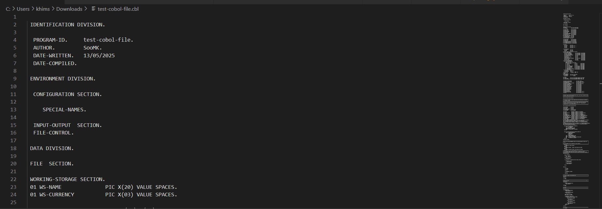
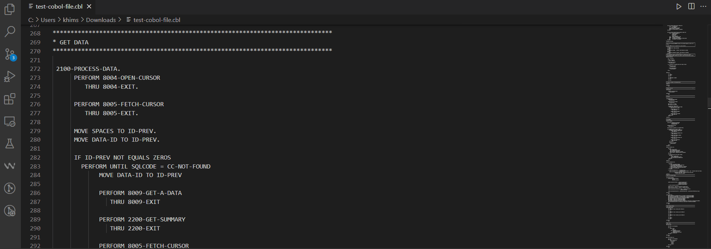

# Visual COBOL CodeFlow

[](./LICENSE.txt)

## Overview

Visual COBOL CodeFlow is a VS Code extension designed to visualize the control flow of Visual COBOL programs. It generates a graph representation of the program's control flow, making it easier to understand and analyze the code.

> Note: Currently, this extension supports only Visual COBOL v5. Compatibility with later versions is not guaranteed.

## Installation

1. Go to the Releases section and download the latest `.vsix` file.

2. In VS Code, open the Command Palette (`Ctrl+Shift+P` or `Cmd+Shift+P` on macOS).

3. ype and select: `Extensions: Install from VSIX...`.

4. Choose the downloaded `.vsix` file.

5. Reload VS Code if prompted.

## Getting Started

### Control Flow View



1. Open a Visual COBOL File in VS Code.

2. To launch the Control Flow View, right-click inside the COBOL file and select "**Show Control Flow View**" from the context menu.

3. The control flow graph will appear. Click on any node in the graph to scroll to the corresponding section of the COBOL code.

> Note: The control flow graph currently does not visualize if conditions or branching logic.

### Call Hierarchy View



1. Open the Explorer View in VS Code.

2. Open your COBOL file and place your cursor on the paragraph name you want to inspect.

3. Right-click and select "**Show Call Hierarchy**". The Call Hierarchy View will appear in the sidebar.
   - You can expand nodes to view all the callers of the selected paragraph.
   - Clicking on a caller will scroll to the corresponding line in the COBOL source file where it is performed.

## Built With

- [antlr4ts](https://github.com/tunnelvisionlabs/antlr4ts) — TypeScript parser generator for Visual COBOL grammar. The grammar file is adopted from [Cobol85.g4](https://github.com/antlr/grammars-v4/blob/master/cobol85/Cobol85.g4) written for ANTLR v4.
- [VS Code Extension API](https://code.visualstudio.com/api) — For integration and UI
- [Mermaid.js](https://mermaid.js.org/syntax/flowchart.html) — For rendering control flow graphs

## Development

1. Clone the Repository

   ```bash
   git clone https://github.com/MkSoo01/Visual-Cobol-CodeFlow.git
   cd Visual-Cobol-CodeFlow
   ```

2. Install Dependencies

   ```
   npm install
   ```

3. Compile the project after making changes

   ```
   npm run compile
   ```

4. Run the Extension
   - Open `src/extension.ts`
   - Press `F5` to open a new Extension Development Host.
   - In the new window, open a COBOL file to test the extension features.
